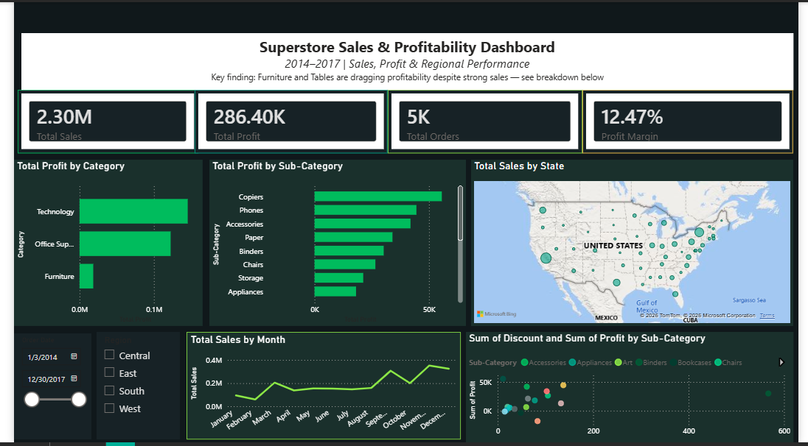

# 📊 Superstore Sales & Profitability Dashboard

**An interactive Power BI dashboard uncovering where a $2.3M retail business is 
actually profitable — and where it's quietly losing money.**

---

## 🎯 The Business Problem

A retail chain is generating strong sales, but sales alone don't tell you if a 
business is healthy. This project asks the harder question: **where is the 
business truly profitable, and where is it losing money despite strong sales?**

Using 4 years of transactional data (2014–2017, 9,994 orders), I built an 
interactive dashboard to separate revenue performance from actual profitability 
— and found several patterns that wouldn't be visible from sales figures alone.

## 🔍 Key Insights

- **Furniture is a hidden problem.** It generates nearly as much revenue as 
  Office Supplies ($742K vs $719K) — but earns **8x less profit** ($18K vs 
  $122K). High sales volume was masking a margin problem.
- **Tables and Bookcases operate at a net loss** — Tables alone lost $17.7K 
  despite $207K in sales, driven by aggressive discounting.
- **Discounting alone doesn't predict losses.** Binders had the *highest* total 
  discount of any sub-category ($567) yet stayed solidly profitable (+$30K) — 
  proving the real issue is discount policy applied without margin context, 
  not discounting itself.
- **Sales peak sharply every November**, a clear seasonal signal for inventory 
  and staffing planning.

## 📈 Dashboard Features

- **4 KPI cards** — Total Sales, Total Profit, Total Orders, Profit Margin
- **Category & Sub-Category profitability breakdown** (bar charts)
- **Geographic sales map** by U.S. state
- **Monthly sales trend** with seasonality
- **Discount vs. Profit scatter analysis** — isolates which discounts actually hurt margin
- **Fully interactive** — Region and Date-range slicers let you filter every visual live

## 🛠️ Tools & Techniques

Power BI Desktop · DAX (`SUM`, `DIVIDE`, `DISTINCTCOUNT`) · Power Query (data 
type cleaning) · custom theming & conditional formatting · interactive filtering

## 📁 Files in This Repo

| File | Description |
|---|---|
| `Superstore_Dashboard.pbix` | Full interactive Power BI file |
| `dashboard_export.pdf` | Static export of the dashboard |
| `Superstore_Presentation.pdf` | 9-slide insights & recommendations deck |
| `dashboard_preview.png` | Preview image (shown above) |

Dataset source: [Superstore Sales Dataset (Kaggle)](https://www.kaggle.com/datasets/vivek468/superstore-dataset-final)

## 💡 What This Project Demonstrates

Beyond the technical build, this project reflects how I approach analysis: 
starting from a business question rather than the data itself, testing 
assumptions instead of taking the first pattern at face value (the Binders 
discount finding), and designing for a stakeholder to explore the data, not 
just view a static report.

## 👤 About Me

Built as part of the **AnalystLab Africa Data Analytics Internship** (Week 4).

**Tess Kamau** — Economics & Finance graduate pivoting into data analytics, 
specializing in financial services.
[LinkedIn](https://linkedin.com/in/tesskamau) · [GitHub](https://github.com/Tee-ai63)
